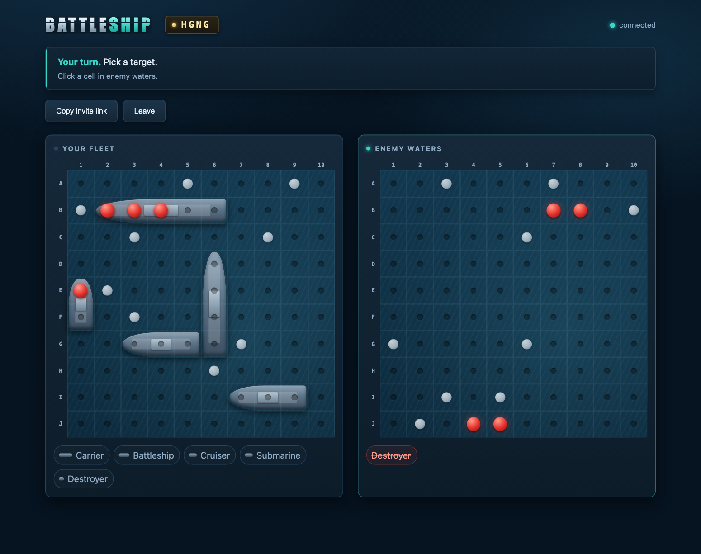
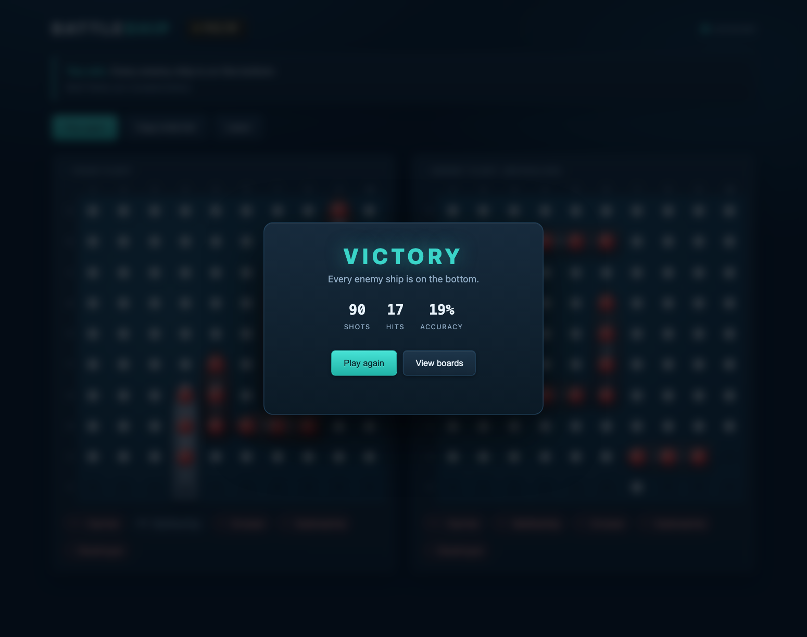

# Battleship over WebSocket

### ▶ [Play it live](https://battleship.sr5.workers.dev)

Two-player Battleship on Cloudflare Workers + Durable Objects. One room = one
Durable Object that holds both fleets, runs every rule, and persists state — so
a dropped connection resumes exactly where it paused.

The server is authoritative. A shot returns hit / miss / sunk for **that one
cell** and nothing else; neither player ever receives the other's layout until
the game is over.



Create a room, send the invite link to a friend, and play. No sign-up, no
install.

## Run it

```bash
npm install
npm test        # pure rules, no server needed
npm run dev     # http://localhost:8787
```

Open the page, click **Create a room**, and share the invite link (or the 4-character
code) with the other player. Two tabs on one machine work fine — identity is
per-tab.

## Deploy it

```bash
npx wrangler login
npm run deploy
```

Lands on a `*.workers.dev` URL. Everything used here — Durable Objects with
SQLite storage, WebSocket Hibernation, static assets — is available on the
Workers **Free** plan.

## Layout

```
src/game.js          pure rules: randomFleet, applyShot, trackingFrom — unit-tested
src/index.js         Worker router + the Room Durable Object
public/index.html    the whole frontend (no framework, no build step)
public/favicon.svg   tab icon — a warship silhouette, plus a PNG fallback
test/game.test.mjs   rules tests, plain Node
test/integration.mjs end-to-end test over real WebSockets (needs `npm run dev`)
wrangler.jsonc       Worker name, ROOM binding, SQLite DO, assets
docs/                README screenshots
```

`src/game.js` imports nothing from Cloudflare, which is what lets `npm test` run
the whole ruleset under plain Node.

## Tests

```bash
npm test                       # 21 rules tests — placement fuzz, validation, hit/sunk/win
npm run dev                    # in one terminal
npm run test:e2e               # in another: 14 checks over real sockets
```

The end-to-end suite plays a full match and asserts the thing that matters. It
scans **every frame** player A received before `gameOver` and fails if B's grid
appears in any of them, if a fleet rides on anything but `board`/`resync`, or if
a fleet disagrees with the grid sent alongside it — which would catch someone
else's ships list even behind an innocent-looking grid.

(It deliberately does *not* compare individual ships by their coordinates: both
players sometimes place a ship on the same squares by chance, and that is A
seeing A's own Destroyer, not a leak.)

## Protocol

Client → server: `hello {playerId?}`, `randomize`, `place {ships}`, `ready`,
`fire {r,c}`, `rematch`. The literal string `ping` is auto-answered with `pong`
by the runtime without waking the room.

`place` carries only `[{name, r, c, horizontal}]` — never a grid. The server
rebuilds the grid itself via `fleetFromPlacements` and rejects anything that
isn't a legal fleet, so a tampered client cannot stack its ships on one cell,
hang them off the board, or field six of them.

Server → client:

| Type | Payload |
|---|---|
| `welcome` | `{slot, playerId, phase}` |
| `full` | — |
| `board` | `{grid, ships}` — yours only |
| `opponent` | `{joined, present, ready, phase}` |
| `youReady` | `{ready}` |
| `start` | `{yourTurn}` |
| `fireResult` | `{r, c, hit, sunk, shipName, win, yourTurn}` |
| `incoming` | `{r, c, hit, sunk, shipName, lose, yourTurn}` |
| `resync` | `{phase, slot, ready, yourTurn, board, tracking, enemySunk, opponent, over, winner, boards}` |
| `gameOver` | `{winner, boards}` — the only message carrying both fleets |
| `rematchPending` | — your request is in, waiting on the other player |
| `rematchOffer` | — the other player wants a rematch |
| `error` | `{msg}` |

Additions to the original plan: `opponent` also carries the room `phase` (so the
waiting player learns the room advanced), `youReady` acknowledges your own
lock-in rather than letting the client assume it, and the two `rematch*`
messages. A granted rematch is delivered as a plain `resync` — the same message
a rejoin uses — so the client has one code path for "here is the whole world
again".

`shipName` is sent only when a ship **sinks** — naming it on a plain hit would
leak the ship's size.

## Rules and behaviour

- **A hit earns another shot; a miss ends the turn.** `EXTRA_SHOT_ON_HIT` in
  [src/game.js](src/game.js) flips this back to strict one-shot-per-turn rules.
  The turn logic in `onFire` is the only reader, and the banner tells the player
  why the turn hasn't changed hands.
- **Arrange your fleet by hand:** drag a ship to move it, click it to rotate, or
  hit Randomize. Ready locks the fleet. Illegal arrangements are refused by the
  server, and the client shows a red hull while you drag somewhere invalid.
- **Rematch:** at game over a modal declares the result with your shot count and
  accuracy. Both players must click *Play again* before the room resets — one
  side alone cannot wipe a finished board out from under the other. The rematch
  keeps the same room, slots and identities, and deals fresh fleets.
- Hits explode, misses splash, and taking a hit shakes your board.
- Rejoin: your `playerId` lives in `sessionStorage`, so a reload or a dropped
  socket puts you back in your slot with your board, your tracking grid, and the
  correct turn. It is **per tab** on purpose — `localStorage` is shared across
  tabs, so a second tab would present the first player's token and the server
  would hand it the same slot.
- Leaving a room abandons that slot. Rooms have no timeout; they hibernate and
  evict naturally. Start a new room to play again.



## Where the security boundary is

`onFire` in [src/index.js](src/index.js) re-checks phase, turn, bounds, and
whether the cell was already fired on **every** shot. The client's opinion about
whose turn it is carries no weight. `onPlace` never accepts a grid — it rebuilds
one from the proposed positions and validates it. `randomize` and `place` reply
only to the requesting socket, and `revealBoth` is called from exactly one
place: game over.
